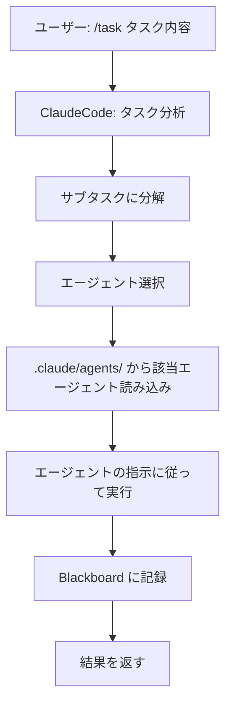

# ClaudeCode マルチエージェント・タスク実行

**ClaudeCode自身が58個のエージェントを動的に使い分けて、タスクを自動実行します。**

## 🎯 使用方法

```
/task <タスク内容>
```

## 📋 例

```
/task Hello Worldを出力するPython関数を作成
/task ログイン機能のRESTful APIを実装
/task このコードのバグを修正して
```

---

## 🤖 システムの動作

### ステップ1: タスク分析

ClaudeCodeがタスクを分析して、必要なサブタスクに分解します：

**例: "Hello World関数を作成"**
```
1. design-function    → system-architect
2. implement-function → backend-developer
3. write-tests        → test-generator
4. document-function  → tech-writer
```

### ステップ2: エージェント選択

タスクの種類に応じて、58個のエージェントから最適なものを自動選択：

| タスク種別 | 使用エージェント |
|-----------|----------------|
| 設計 | system-architect, cloud-architect |
| 実装 | backend-developer, frontend-developer |
| テスト | test-generator, qa-validator |
| 文書化 | tech-writer, doc-reviewer |
| デバッグ | expert-debugger, bug-fixer |
| セキュリティ | security-tester, security-architect |

### ステップ3: 実行

選択されたエージェントの指示に従って、ClaudeCodeが実際にコードを生成・実行します。

### ステップ4: 記録

全ての実行履歴をBlackboardに記録：
- `Multi-Agent/deliverable/reporting/blackboard_log.md`
- `Multi-Agent/deliverable/reporting/blackboard_state.json`

---

## 🧩 タスクタイプ別の処理

### Python関数作成
```
/task 素数判定関数を作成
```
→ **backend-developer** が実装
→ **test-generator** がテスト作成
→ **tech-writer** がドキュメント作成

### API開発
```
/task ユーザー登録APIを作成
```
→ **api-designer** が設計
→ **api-developer** が実装
→ **security-tester** がセキュリティチェック

### バグ修正
```
/task このエラーを修正して
```
→ **expert-debugger** が原因分析
→ **bug-fixer** が修正
→ **test-generator** がリグレッションテスト作成

### デプロイ
```
/task 本番環境にデプロイ
```
→ **devops-engineer** がCI/CD設定
→ **deployment-agent** が実行
→ **monitoring-specialist** が監視設定

---

## 📊 実行プロセス



---

## 🔍 エージェント一覧（58個）

### Planning Pod (9)
- product-manager, system-architect, requirements-elicitation...

### Implementation Pod (9)
- backend-developer, frontend-developer, api-developer...

### QA Pod (9)
- test-generator, qa-validator, security-tester...

### Operations Pod (10)
- devops-engineer, deployment-agent, monitoring-specialist...

### Meta Pod (6)
- coordinator-agent, meta-agent, workflow-coordinator...

### その他 (15)
- bug-fixer, expert-debugger, tech-writer...

---

## 💡 利点

### 従来の方法
```
ClaudeCode → 単独で処理 → 結果
```

### Multi-Agent方式
```
ClaudeCode → タスク分析
           → 適切な専門エージェント選択
           → 各エージェントが協調動作
           → 高品質な結果
```

**メリット:**
- ✅ 各タスクに最適な専門家が担当
- ✅ 並列処理で高速化
- ✅ 全履歴が記録される
- ✅ Best-of-N で最良案を自動選択

---

## 🎓 実行例

### 例1: シンプルな関数作成

**入力:**
```
/task Hello Worldを出力するPython関数を作成
```

**ClaudeCodeの動作:**
1. タスク分析: "Python関数作成" → `backend-developer` 選択
2. `backend-developer` エージェント読み込み
3. 指示に従って実装:
   ```python
   def hello_world():
       """Hello Worldを出力する関数"""
       print("Hello World")
       return "Hello World"
   ```
4. `test-generator` がテスト作成
5. Blackboard に記録

---

### 例2: 複雑なAPI実装

**入力:**
```
/task ユーザー認証APIをJWTで実装
```

**ClaudeCodeの動作:**
1. サブタスク分解:
   - API設計
   - JWT実装
   - セキュリティチェック
   - テスト作成
2. エージェント割り当て:
   - `api-designer` → API設計
   - `backend-developer` → 実装
   - `security-tester` → セキュリティ検証
   - `test-generator` → テスト作成
3. 順次実行
4. 結果統合

---

## 📂 記録先

全ての実行履歴:
- `Multi-Agent/deliverable/reporting/blackboard_log.md` - 詳細ログ
- `Multi-Agent/deliverable/reporting/blackboard_state.json` - 状態
- `Multi-Agent/deliverable/reporting/blackboard_events.jsonl` - イベント

---

## 🚀 今すぐ試す

```
/task Hello Worldを出力するPython関数を作成
```

ClaudeCodeが自動的に：
1. backend-developer を起動
2. 関数を実装
3. テストを作成
4. ドキュメントを生成
5. 全て記録

---

**🎉 これでClaudeCode自身がマルチエージェント・システムになります！**
